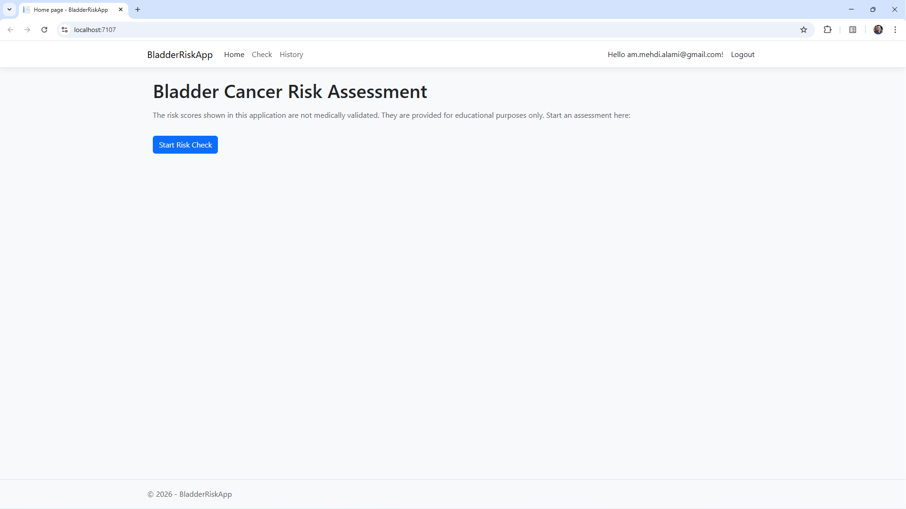
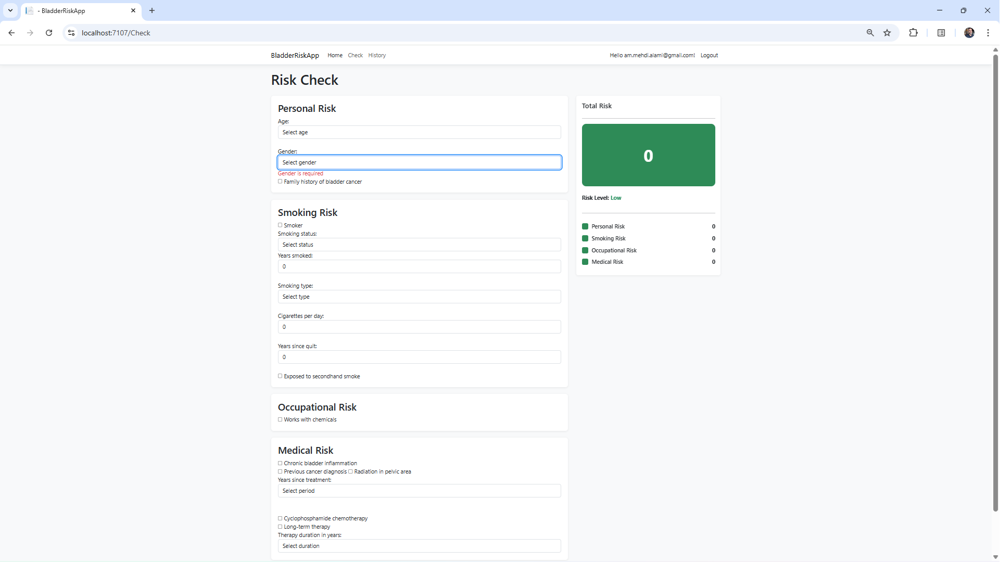
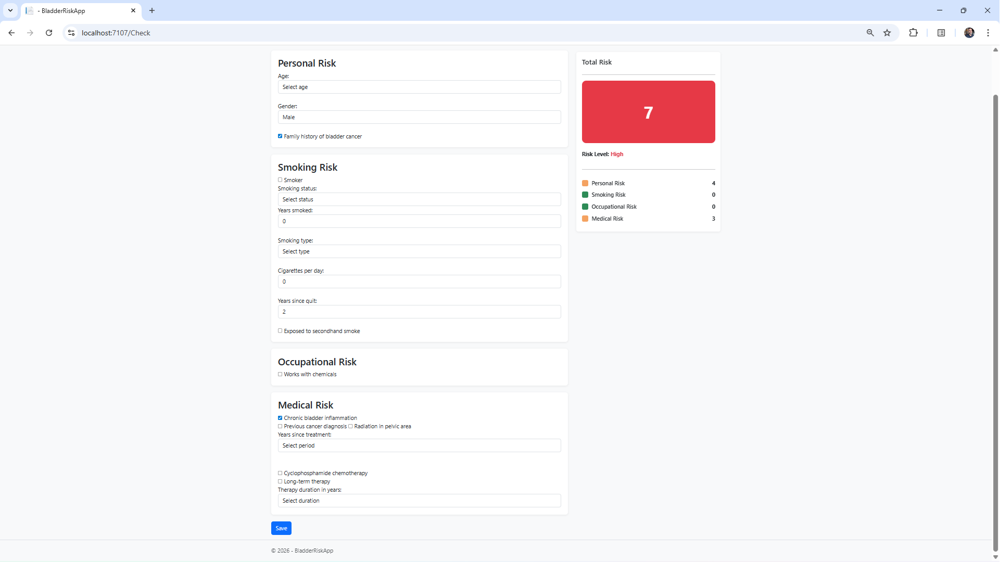
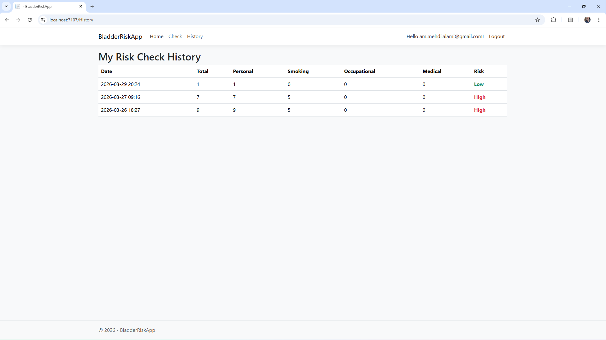

# Bladder Risk App

This web application calculates a sample risk score based on user input.

⚠️ The scores shown in this application are not medical advice.  
They are examples created for learning and demonstration purposes only.

## Features

- Risk calculation based on user inputs
- Section-based scoring:
  - Personal
  - Smoking
  - Occupational
  - Medical
- Daily history per user
- ASP.NET Razor Pages
- Entity Framework Core
- Authentication (login required to save)

## Screenshots

### Home



### Risk Check



### High Risk Check



### History




## How to run

```bash
dotnet run